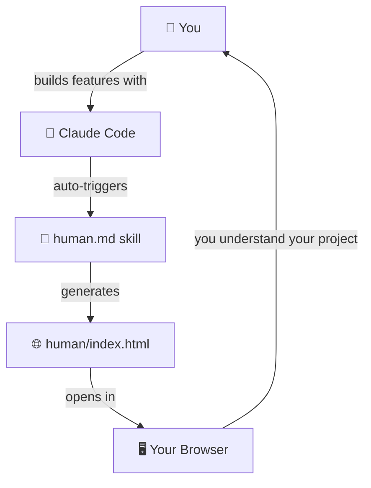

# human.md

**Keep humans in the loop.**

`claude.md` gives AI context about your project. `human.md` gives *you* that same understanding.

A [Claude Code](https://claude.ai/code) skill that generates a visual, plain-English guide to your codebase — so you always know what AI built, how it connects, and why.

## The Problem

You're a vibe coder. You describe features, AI builds them, things work. But after a dozen features, you realize you don't actually know how your own project works anymore. You can't debug issues, you can't explain your app to others, and you're scared to change anything because you don't know what might break.

**human.md** fixes this by keeping you in the loop as your project grows.

## What It Does

After major changes, Claude automatically generates (or updates) a single HTML file — `human/index.html` — that you open in your browser. It contains:

- **The Big Picture** — A plain-English narrative of what your project does
- **Architecture Diagram** — A visual map of all the moving parts (Mermaid JS)
- **User Flow Diagrams** — Step-by-step visuals: *user clicks button → frontend → API → database → response*
- **Key Decisions** — Why things were built this way, what the trade-offs are
- **What Changed** — A narrative of recent changes (not a git log — a story)

Everything is written for humans, not programmers. No jargon. No file paths. No function signatures. Just the story of your project.



## Install

In Claude Code, run:

```
/plugin marketplace add tsengtinghan/human.md
/plugin install human@human-md
```

That's it. `/human:human` is now available in all your projects.

## Usage

### First run

```
/human:human
```

On first use, it scans your entire project and generates a full `human/index.html` with architecture diagrams, user flows, and plain-English explanations. It opens automatically in your browser.

### After making changes

```
/human:human
```

On subsequent runs, it only looks at what changed since the last update — no full rescan. It updates the affected sections and adds a "What Changed" entry.

### Focus on a specific area

```
/human:human auth flow
```

Updates just the section for a specific area (e.g. auth, payments, database schema).

### Automatic

Claude will also auto-trigger updates after major structural changes (new routes, schema changes, integrations, significant refactors).

## What You Get

A single `human/index.html` file at your project root. Double-click it (or Claude opens it for you automatically). It looks like this:

- Clean, readable page with a table of contents
- Interactive Mermaid diagrams that render live in the browser
- Collapsible sections for each user flow
- Works offline — no server needed
- Bookmark the URL to come back anytime

## Philosophy

AI is great at building. Humans are great at deciding *what* to build. But that only works if the human understands the current state of things. 

**human.md** is based on a simple idea: the human should always have a clear mental model of their project, even if AI wrote every line of code. Not because they need to read the code — but because they need to *own* the product.

## License

MIT
